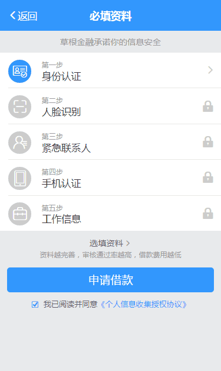
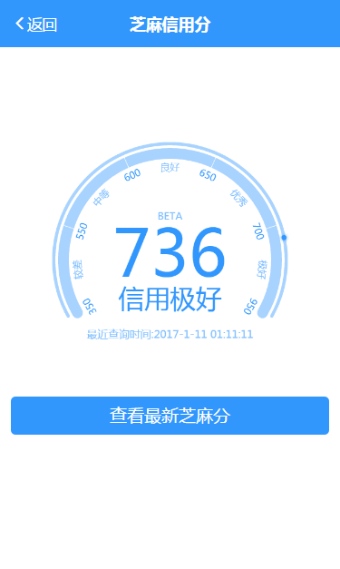
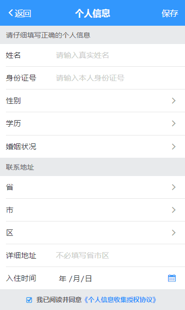

# vuePro-demo

练习项目基本是用vue2和vue-router2来实现的，满多地方可以填坑的。欢迎交流学习，使用的页面完全来自“草根金融/宋江贷”APP，所以请勿用于商业或公司项目。

线上访问地址：[https://jingjingke.github.io/vuePro-demo/dist/](https://jingjingke.github.io/vuePro-demo/dist/)


## 使用 ##

（1）克隆项目
```bash
		git clone https://github.com/jingjingke/vuePro-demo.git
```
（2）安装node_modules文件夹：
```bash
		npm install
```
> 或去我的百度网盘获取rar压缩包[点击这个地址](http://pan.baidu.com/s/1mhQZenY)
>
>【2017.03.03】这个rar压缩包已经不是最新了，如果继续使用的话，还需要执行一次npm install

（3）开发，输入命令行
```bash
		npm run dev
```

（4）发布，可输入命令行
```bash
		npm run build
```
> 注意：【生产环境】在根目录config/index.js文件中build对象'assetsPublicPath'属性
> 我填写的是我当前的线上资源需放置的地址：'https://jingjingke.github.io/vuePro-demo/dist/'
> （根据你的资源位置填写相应的值，默认值可能会出现生产环境资源404-url不正确的情况）


## 前置知识 ##
开发中使用了vue-cli(webpack包)、vue2、vue-router2、vuex2以及部分ES6语法(箭头语法)。建议阅读：

vue2中文指南：[http://cn.vuejs.org/v2/guide/](http://cn.vuejs.org/v2/guide/)

vue-router2：[http://router.vuejs.org/zh-cn/index.html](http://router.vuejs.org/zh-cn/index.html)

vuex指南开始：[http://vuex.vuejs.org/zh-cn/intro.html](http://vuex.vuejs.org/zh-cn/intro.html)

另外可查看vue2中文指南上面的例子汇总(只整理了部分，方便我自己使用而做的)，[点击查看](http://www.jingjingke.com/c/14248.html)。


## 目录结构 ##

```pre

├── build                    // webpack打包配置（不说明它下面的文件）
├── config                   // webpack环境配置（不说明它下面的文件）
├── dist                     // 运行build后生成目录(存放需要的发布代码)
├── src                      // 生产目录(着重说明)
│   ├── assets               // 静态资源(css,font,img,js)
│   ├── components           // vue组件
│   ├── config               // Vue全局方法/过滤器
│   ├── data                 // 数据文件(json)
│   ├── views                // 业务页面
│   ├── main.js              // 项目入口文件
│   └── router.js            // 路由配置
├── .babelrc                 // babel工具配置
├── .editorconfig            // 编码风格配置(不太影响开发)
├── .gitignore               // git项目忽略上传的文件/文件夹配置
├── .project                 // 我编辑器生成的，对项目无用
├── README.md                // 说明文档
├── _config.yml              // git pages选择风格生成的
├── package.json             // 项目配置信息

```

## 项目截图 ##





